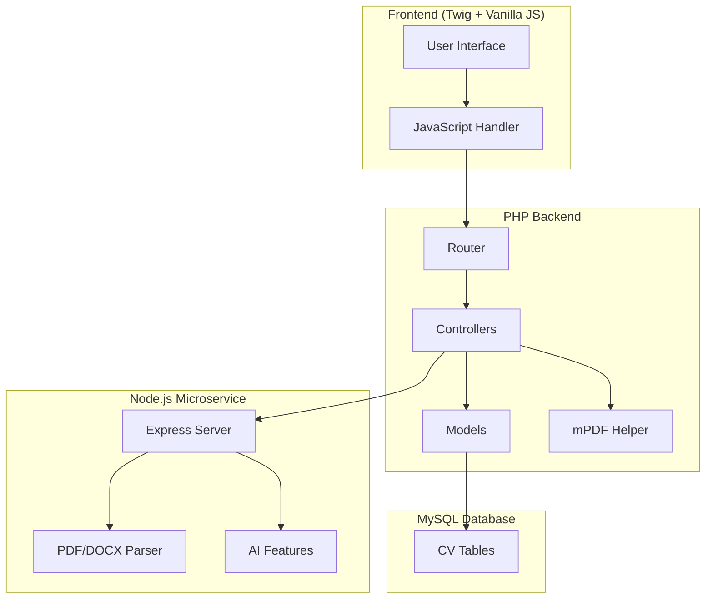

# CV Builder Architecture

## Overview
The CV Builder is a modular, scalable system with AI assistance built on the existing PHP/Twig stack and a new Node.js microservice for AI features.

## Architecture Diagram

## Components

### 1. Database Schema
- `cvs` - Main CV metadata
- `cv_sections` - Dynamic sections (summary, experience, etc.)
- `cv_items` - JSON-based content for each section
- `cv_shares` - Shareable tokens

### 2. PHP Backend
- **Routes** (`app/Routes/`): Defined in `CvController.php`
- **Controllers**: `CvController.php` - Handles all CV operations
- **Models**: `CvModel`, `CvSectionModel`, `CvItemModel`, `CvShareModel`
- **Views**: Twig templates in `app/Views/cv/`
- **Helpers**: Use existing `MpdfHelper`, `AuthAndSecurityHelper`, `PurifierHelper`

### 3. Node.js Microservice
- **Port**: 3001
- **Features**: Text improvement, ATS scoring, keyword extraction, CV import
- **Security**: Rate limiting, file validation, CORS

### 4. Frontend
- **Templates**: Split view (form + preview)
- **JavaScript**: Debounced API calls, drag & drop, auto-save
- **Styling**: Tailwind CSS

## API Contracts

### PHP to Node.js
- `POST http://localhost:3001/ai/improve` - Improve text
- `POST http://localhost:3001/ai/ats-score` - ATS score
- `POST http://localhost:3001/ai/keyword-extract` - Keyword extraction
- `POST http://localhost:3001/cv/import` - CV import

### Frontend to PHP
- `GET /cv` - List CVs
- `POST /cv` - Create CV
- `GET /cv/:id` - Get CV
- `PUT /cv/:id` - Update CV
- `DELETE /cv/:id` - Delete CV
- `POST /cv/:id/sections` - Add section
- `PUT /cv/:id/sections/:section_id` - Update section
- `DELETE /cv/:id/sections/:section_id` - Delete section
- `PATCH /cv/:id/sections/reorder` - Reorder sections
- Similar for items
- `GET /cv/:id/preview` - Preview
- `GET /cv/:id/export` - Export PDF
- `POST /cv/:id/share` - Generate share token
- `GET /cv/view/:token` - Public view

## Security

1. **Authentication**: Use existing `AuthManager`
2. **Authorization**: Validate ownership on every CV operation
3. **CSRF**: Use `validateCsrfToken()` for state-changing routes
4. **Input Sanitization**: Use `PurifierHelper::purify()`
5. **File Validation**: Validate type and size for import
6. **Rate Limiting**: Apply rate limiting on AI endpoints

## Performance

1. **Auto-save**: Debounced (3-5 seconds) to reduce server load
2. **Caching**: Cache preview responses (Redis optional)
3. **Indexes**: Add indexes on `user_id`, `cv_id`, `order`
4. **JSON**: Use JSON for flexible content to avoid schema changes

## File List

### Database
- `plans/cv_database_schema.md` - SQL schema

### PHP
- `app/Controllers/CvController.php` - Main controller
- `app/Models/CvModel.php` - CV model
- `app/Models/CvSectionModel.php` - Section model
- `app/Models/CvItemModel.php` - Item model
- `app/Models/CvShareModel.php` - Share model

### Views
- `app/Views/cv/dashboard.twig` - CV list
- `app/Views/cv/editor.twig` - Editor with split view
- `app/Views/cv/partials/section_*.twig` - Section templates
- `app/Views/cv/partials/item_*.twig` - Item templates
- `app/Views/cv/templates/modern.twig` - Modern template
- `app/Views/cv/templates/minimal.twig` - Minimal template
- `app/Views/cv/templates/ats.twig` - ATS-friendly template

### JavaScript
- `public_html/assets/js/cv-builder.js` - Main JS handler

## Next Steps

1. Create database tables
2. Implement PHP models
3. Implement CvController
4. Create Twig templates
5. Implement JavaScript handlers
6. Set up Node.js service
7. Test and optimize