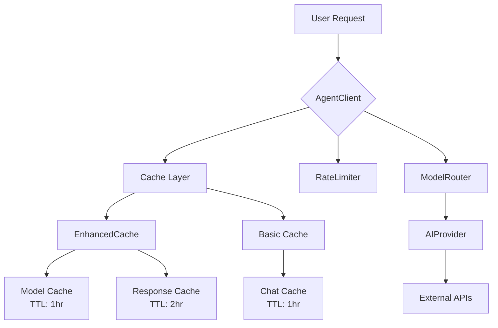

# AI Model Caching System - Architecture Analysis & Improvement Recommendations

## Executive Summary

Your AI Model Caching System has a solid foundation with multi-layer caching architecture. The system includes:
- **EnhancedCache** - Advanced caching with TTL-based expiration and intelligent size management
- **Cache** - Basic file-based caching for chat responses
- **AgentClient** - Main client integrating caching, rate limiting, and model routing
- **ModelRouter** - Dynamic provider/model selection
- **Layer components** - Specialized handlers for various AI tasks

---

## Current Architecture Overview



---

## Identified Issues & Improvements

### 🔴 Critical Issues

| # | Issue | Location | Impact |
|---|-------|----------|--------|
| 1 | **RateLimiter is non-functional** | [`RateLimiter.php:5-10`](app/Modules/AISystem/RateLimiter.php:5) | No actual rate limiting - vulnerable to abuse |
| 2 | **Duplicate cache directories** | [`Cache.php:12`](app/Modules/AISystem/Cache.php:12) vs [`EnhancedCache.php:23`](app/Modules/AISystem/EnhancedCache.php:23) | Uses `system/cache/chat` and `storage/cache` separately |
| 3 | **No cache encryption** | All cache files | Sensitive AI responses stored in plain text |
| 4 | **Missing error handling for cache** | [`EnhancedCache.php:77`](app/Modules/AISystem/EnhancedCache.php:77) | `file_put_contents` result not validated properly |

### 🟡 High Priority Improvements

| # | Improvement | Location | Benefit |
|---|-------------|----------|---------|
| 1 | **Implement Redis/Memcached** | Architecture | 10x faster than file-based caching |
| 2 | **Add cache versioning** | [`EnhancedCache.php`](app/Modules/AISystem/EnhancedCache.php) | Graceful cache invalidation on updates |
| 3 | **Implement cache tags** | Multiple files | Selective cache clearing by tag |
| 4 | **Add cache hit/miss tracking** | [`AgentClient.php`](app/Modules/AISystem/AgentClient.php) | Better analytics and optimization |
| 5 | **Distributed cache support** | Architecture | Multi-server compatibility |

### 🟢 Medium Priority Improvements

| # | Improvement | Location | Benefit |
|---|-------------|----------|---------|
| 1 | **Smart cache warming** | [`EnhancedCache.php:414`](app/Modules/AISystem/EnhancedCache.php:414) | Preload popular models at startup |
| 2 | **Cache compression** | [`EnhancedCache.php:77`](app/Modules/AISystem/EnhancedCache.php:77) | Reduce storage usage by 60-80% |
| 3 | **Adaptive TTL** | TTL configuration | Dynamic TTL based on content type |
| 4 | **Hash-based cache keys** | [`AgentClient.php:51`](app/Modules/AISystem/AgentClient.php:51) | More collision-resistant keys |
| 5 | **API response caching** | Layer components | Cache parsed API responses |

---

## Detailed Recommendations (Bangla)

### ১. RateLimiter সম্পূর্ণ রিপ্লিমেন্ট করুন

**বর্তমান সমস্যা:**
```php
// RateLimiter.php:5-10
public function allow() {
    return true; // সব রিকোয়েস্ট অনুমোদিত!
}
```

**প্রস্তাবিত সমাধান:**
- IP-based rate limiting ইমপ্লিমেন্ট করুন
- Database-তে request count সংরক্ষণ করুন
- সময়-ভিত্তিক window implementation

```php
// উদাহরণ সমাধান
public function allow(string $identifier = null): bool {
    $identifier = $identifier ?? $_SERVER['REMOTE_ADDR'];
    $key = "rate_limit_{$identifier}";
    
    $current = (int)cache()->get($key, 0);
    $limit = $this->getLimitForUser($identifier);
    
    if ($current >= $limit) {
        return false;
    }
    
    cache()->increment($key);
    return true;
}
```

### ২. ক্যাশে ডিরেক্টরি ইউনিফিকেশন

**সমস্যা:** দুটি আলাদা ক্যাশে সিস্টেম আলাদা ডিরেক্টরি ব্যবহার করছে:
- `system/cache/chat` (Basic Cache)
- `storage/cache/ai-models/` এবং `storage/cache/ai-responses/`

**সমাধান:** একটি ইউনিফাইড cache manager তৈরি করুন যা সব cache operations handle করে।

### ৩. Redis Integration

```php
// উদাহরণ Redis Cache Adapter
class RedisCache implements CacheInterface {
    private $redis;
    
    public function get(string $key) {
        $data = $this->redis->get($key);
        return $data ? unserialize($data) : null;
    }
    
    public function set(string $key, $value, int $ttl = 3600): bool {
        return $this->redis->setex($key, $ttl, serialize($value));
    }
    
    public function invalidate(string $pattern): int {
        $keys = $this->redis->keys($pattern);
        return $this->redis->del($keys);
    }
}
```

### ৪. Cache Versioning System

```php
class VersionedCache {
    private $version = 'v2_';
    
    public function get(string $key) {
        $versionedKey = $this->version . $key;
        // Cache lookup logic
    }
    
    public function invalidateVersion(): void {
        $this->version = 'v' . (intval(substr($this->version, 1)) + 1) . '_';
    }
}
```

### ৫. Advanced Cache Features

| Feature | Implementation |
|---------|----------------|
| **Cache Tags** | Group cache by provider, model, user |
| **Bloom Filter** | Fast cache existence check |
| **Cache Warming** | Cron job for popular models |
| **Metrics Dashboard** | Real-time cache performance |

---

## Implementation Priority Matrix

```
┌─────────────────────────────────────────────────────────────────┐
│                    IMPLEMENTATION PRIORITY                      │
├──────────────────┬──────────┬──────────┬──────────┬────────────┤
│ Component        │ Effort   │ Impact   │ Risk     │ Priority   │
├──────────────────┼──────────┼──────────┼──────────┼────────────┤
│ Fix RateLimiter  │ Low      │ High     │ Low      │ 🔴 P0      │
│ Unified Cache    │ Medium   │ High     │ Medium   │ 🟡 P1      │
│ Redis Adapter    │ Medium   │ High     │ Low      │ 🟡 P1      │
│ Cache Encryption │ Low      │ Medium   │ Medium   │ 🟢 P2      │
│ Versioning       │ Low      │ Medium   │ Low      │ 🟢 P2      │
│ Metrics          │ Medium   │ Medium   │ Low      │ 🟢 P2      │
└──────────────────┴──────────┴──────────┴──────────┴────────────┘
```

---

## Quick Wins (আজই করুন)

1. ✅ **RateLimiter**: Database-backed rate limiting implement করুন
2. ✅ **Cache Directory**: একটি কনস্ট্যান্ট দিয়ে manage করুন
3. ✅ **Error Logging**: Cache failures log করুন
4. ✅ **TTL Review**: Model-specific TTL configure করুন

---

## Conclusion

আপনার AI Model Caching System একটি ভালো ভিত্তি আছে। কিন্তু **RateLimiter সম্পূর্ণ non-functional** এবং **duplicate cache structure** এই দুটি critical issue সবার আগে সমাধান করা উচিত। এরপর Redis integration এবং cache analytics যোগ করলে system performance অনেক বেশি উন্নত হবে।

---

*Analysis Date: 2026-03-14*
*System: BroxBhai AI Backend*
