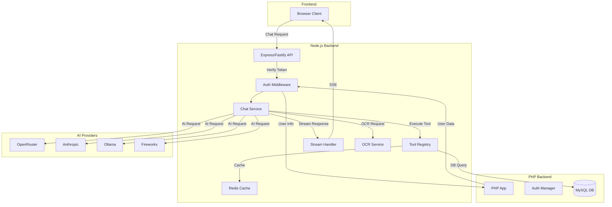
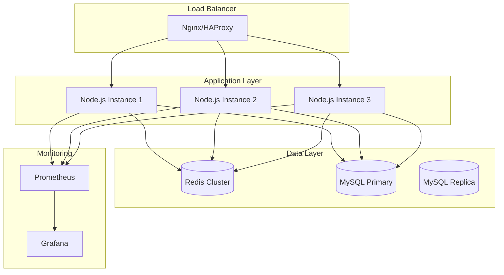

# AI Assistant Migration Plan: PHP → Node.js + TypeScript

## Executive Summary

This document outlines the migration strategy for migrating the AI Assistant backend from PHP to Node.js + TypeScript. The migration will improve performance, enable real-time streaming, and provide better developer experience with modern tooling.

---

## Current PHP Implementation Analysis

### Core Components

| Component | File | Purpose |
|-----------|------|---------|
| **AIProvider** | `app/Models/AIProvider.php` | Manages AI provider configurations (OpenRouter, Anthropic, etc.) |
| **AISystemController** | `app/Controllers/AISystemController.php` | Handles chat requests, streaming, tool execution |
| **ToolRegistry** | `app/Helpers/ToolRegistry.php` | Centralized tool execution with caching, circuit breaker |
| **ToolDefinitions** | `app/Helpers/ToolDefinitions.php` | 14 registered tools (DB query, system health, etc.) |
| **PromptLoader** | `app/Helpers/PromptLoader.php` | Loads system prompts and knowledge base context |
| **AIChatModel** | `app/Models/AIChatModel.php` | Manages conversation history |
| **AISystemRoutes** | `app/Routes/AISystemRoutes.php` | 30+ API endpoints |

### Current API Endpoints

#### Chat Endpoints
- `POST /api/ai/chat` - Public assistant with SSE streaming
- `POST /api/admin/ai/chat` - Admin-only assistant with SSE streaming
- `POST /api/ai-system/chat` - Legacy alias for admin

#### Tool & Feature Endpoints
- `GET /api/admin/ai-tools` - List available tools
- `POST /api/admin/ai/websearch` - Web search integration
- `POST /api/admin/ai/pdf` - PDF processing
- `POST /api/admin/ai/tts` - Text-to-speech
- `POST /api/admin/ai/image` - Image generation
- `POST /api/admin/ai/upload` - Image upload for copilot
- `POST /api/ai/clear-image-context` - Clear image context

#### OCR Endpoints
- `GET /api/ai/ocr/health` - OCR service health check
- `POST /api/ai/ocr/image` - Extract text from images
- `POST /api/ai/ocr/pdf` - Extract text from PDFs
- `POST /api/ai/ocr/batch` - Batch OCR processing
- `POST /api/ai/ocr/upload` - File upload OCR

#### Admin & Management
- `GET /api/ai/models/list` - List available models
- `GET /api/ai/models/info` - Model information
- `GET /api/ai/cache/stats` - Cache statistics
- `POST /api/ai/cache/clear` - Clear cache
- `POST /api/ai/test` - Test AI connection
- `GET /api/ai/default-provider` - Get default provider
- `GET /api/ai-system/frontend` - Frontend settings
- `GET /api/ai-system/admin-defaults` - Admin defaults

#### Session & Presence
- `GET /api/admin/ai/presence` - Active sessions
- `POST /api/admin/ai/heartbeat` - Keep session alive
- `POST /api/admin/ai/share` - Share session

#### Feedback
- `POST /api/ai/knowledge/feedback` - Knowledge base feedback
- `POST /api/ai/feedback` - General feedback

### Registered Tools (14 total)

1. `get_system_health` - System diagnostics
2. `query_database` - Execute SQL queries
3. `get_table_stats` - Table statistics
4. `analyze_error_logs` - Error log analysis
5. `summarize_text` - Text summarization
6. `get_cache_stats` - Cache statistics
7. `get_user_stats` - User statistics
8. `get_content_stats` - Content statistics
9. `list_tools` - List available tools
10. `clear_cache` - Clear cache
11. `list_storage_files` - List storage files
12. `get_app_settings` - Get app settings
13. `search_knowledge_base` - Search knowledge base
14. `reindex_knowledge_base` - Reindex knowledge base

---

## Node.js + TypeScript Architecture

### System Architecture Diagram



### Technology Stack

| Layer | Technology | Purpose |
|-------|-------------|---------|
| **Runtime** | Node.js 20+ LTS | JavaScript runtime |
| **Language** | TypeScript 5+ | Type-safe development |
| **Framework** | Fastify 4+ | High-performance web framework |
| **AI SDKs** | `openai`, `@anthropic-ai/sdk` | Official AI provider SDKs |
| **Database** | `mysql2/promise` | MySQL driver with promises |
| **Cache** | `ioredis` | Redis client |
| **Validation** | `zod` | Runtime type validation |
| **Streaming** | Native SSE | Server-Sent Events |
| **WebSocket** | `ws` | Real-time communication |
| **OCR** | `tesseract.js` | Client-side OCR |
| **Testing** | `vitest`, `@playwright/test` | Unit & E2E testing |
| **Logging** | `pino` | Structured logging |
| **Monitoring** | `prom-client` | Prometheus metrics |

---

## File Structure

```

├── src/
│   ├── index.ts                 # Application entry point
│   ├── app.ts                  # Fastify app configuration
│   ├── config/
│   │   ├── index.ts            # Config loader
│   │   ├── database.ts         # Database config
│   │   ├── redis.ts            # Redis config
│   │   └── ai-providers.ts     # AI provider configs
│   ├── types/
│   │   ├── index.ts            # Global type definitions
│   │   ├── chat.ts             # Chat-related types
│   │   ├── tools.ts            # Tool-related types
│   │   └── providers.ts        # AI provider types
│   ├── routes/
│   │   ├── index.ts            # Route aggregator
│   │   ├── chat.routes.ts      # Chat endpoints
│   │   ├── tools.routes.ts     # Tool endpoints
│   │   ├── ocr.routes.ts       # OCR endpoints
│   │   ├── admin.routes.ts     # Admin endpoints
│   │   └── health.routes.ts    # Health check
│   ├── services/
│   │   ├── chat.service.ts     # Chat logic
│   │   ├── stream.service.ts   # Streaming handler
│   │   ├── ocr.service.ts      # OCR service
│   │   ├── cache.service.ts    # Cache operations
│   │   ├── prompt.service.ts   # Prompt loading
│   │   └── kb.service.ts       # Knowledge base
│   ├── tools/
│   │   ├── registry.ts         # Tool registry
│   │   ├── definitions.ts      # Tool definitions
│   │   ├── database/
│   │   │   ├── query.tool.ts
│   │   │   ├── table-stats.tool.ts
│   │   │   └── user-stats.tool.ts
│   │   ├── system/
│   │   │   ├── health.tool.ts
│   │   │   ├── cache.tool.ts
│   │   │   └── logs.tool.ts
│   │   └── content/
│   │       ├── summarize.tool.ts
│   │       └── content-stats.tool.ts
│   ├── providers/
│   │   ├── base.provider.ts    # Base provider class
│   │   ├── openrouter.provider.ts
│   │   ├── anthropic.provider.ts
│   │   ├── ollama.provider.ts
│   │   └── fireworks.provider.ts
│   ├── middleware/
│   │   ├── auth.middleware.ts  # Authentication
│   │   ├── admin.middleware.ts # Admin-only
│   │   ├── csrf.middleware.ts  # CSRF protection
│   │   ├── rate-limit.middleware.ts
│   │   └── error.middleware.ts
│   ├── models/
│   │   ├── conversation.model.ts
│   │   ├── message.model.ts
│   │   └── user.model.ts
│   ├── utils/
│   │   ├── logger.ts           # Pino logger
│   │   ├── validator.ts        # Zod schemas
│   │   ├── stream.ts           # Stream utilities
│   │   └── image.ts            # Image processing
│   └── constants/
│       ├── errors.ts            # Error codes
│       └── limits.ts           # Rate limits, etc.
├── tests/
│   ├── unit/
│   ├── integration/
│   └── e2e/
├── scripts/
│   ├── migrate.ts              # Migration script
│   └── seed.ts                 # Seed data
├── package.json
├── tsconfig.json
├── .env.example
├── .eslintrc.js
├── .prettierrc
└── README.md
```

---

## Core Components Design

### 1. Chat Service

```typescript
// src/services/chat.service.ts
import { FastifyRequest, FastifyReply } from 'fastify';
import { ToolRegistry } from '../tools/registry';
import { PromptService } from './prompt.service';
import { AIProviderFactory } from '../providers';

export class ChatService {
  constructor(
    private toolRegistry: ToolRegistry,
    private promptService: PromptService,
    private providerFactory: AIProviderFactory
  ) {}

  async handleChat(
    request: FastifyRequest,
    reply: FastifyReply,
    isAdmin: boolean
  ): Promise<void> {
    const { messages, stream, options } = request.body as ChatRequest;
    
    // Normalize messages
    const normalizedMessages = this.normalizeMessages(messages);
    
    // Extract and execute tools
    const toolResult = await this.executeTools(normalizedMessages, isAdmin);
    
    // Build system prompt
    const systemPrompt = await this.buildSystemPrompt(
      normalizedMessages,
      isAdmin,
      toolResult
    );
    
    // Get AI provider
    const provider = this.providerFactory.getProvider(options?.provider);
    
    // Stream or non-stream response
    if (stream) {
      await this.streamResponse(
        reply,
        provider,
        systemPrompt,
        normalizedMessages,
        options
      );
    } else {
      const response = await provider.chat(
        systemPrompt,
        normalizedMessages,
        options
      );
      reply.send(response);
    }
  }

  private async executeTools(
    messages: Message[],
    isAdmin: boolean
  ): Promise<ToolResult | null> {
    const lastUserMessage = this.getLastUserMessage(messages);
    const command = this.toolRegistry.parseCommand(lastUserMessage);
    
    if (!command) return null;
    
    return await this.toolRegistry.execute(
      command.name,
      command.args,
      isAdmin
    );
  }
}
```

### 2. Tool Registry

```typescript
// src/tools/registry.ts
import { z } from 'zod';

export interface ToolDefinition {
  name: string;
  displayName: string;
  description: string;
  parameters: z.ZodSchema;
  namespace?: string;
  requiresAuth: boolean;
  cacheable: boolean;
  timeout: number;
  maxRetries: number;
  execute: (args: any, context: ToolContext) => Promise<ToolResult>;
}

export class ToolRegistry {
  private tools = new Map<string, ToolDefinition>();
  private cache = new Map<string, { data: any; expires: number }>();
  private circuitBreaker = new Map<string, CircuitBreakerState>();

  register(definition: ToolDefinition): void {
    this.tools.set(definition.name, definition);
  }

  async execute(
    name: string,
    args: any,
    context: ToolContext
  ): Promise<ToolResult> {
    const tool = this.tools.get(name);
    if (!tool) {
      throw new ToolNotFoundError(name);
    }

    // Check circuit breaker
    if (this.isCircuitOpen(name)) {
      throw new CircuitBreakerOpenError(name);
    }

    // Check cache
    if (tool.cacheable) {
      const cached = this.getFromCache(name, args);
      if (cached) {
        return { success: true, data: cached, cached: true };
      }
    }

    // Validate parameters
    const validated = tool.parameters.parse(args);

    // Execute with retry logic
    return await this.executeWithRetry(tool, validated, context);
  }

  private async executeWithRetry(
    tool: ToolDefinition,
    args: any,
    context: ToolContext,
    attempt = 0
  ): Promise<ToolResult> {
    try {
      const result = await Promise.race([
        tool.execute(args, context),
        this.timeout(tool.timeout)
      ]);

      // Reset circuit breaker on success
      this.resetCircuitBreaker(tool.name);

      // Cache result if cacheable
      if (tool.cacheable) {
        this.setCache(tool.name, args, result);
      }

      return { success: true, data: result };
    } catch (error) {
      // Record failure for circuit breaker
      this.recordFailure(tool.name);

      // Retry if attempts remaining
      if (attempt < tool.maxRetries) {
        await this.delay(Math.pow(2, attempt) * 1000);
        return this.executeWithRetry(tool, args, context, attempt + 1);
      }

      throw error;
    }
  }
}
```

### 3. Stream Service

```typescript
// src/services/stream.service.ts
import { FastifyReply } from 'fastify';

export class StreamService {
  async streamSSE(
    reply: FastifyReply,
    generator: AsyncGenerator<StreamChunk>
  ): Promise<void> {
    reply.raw.setHeader('Content-Type', 'text/event-stream');
    reply.raw.setHeader('Cache-Control', 'no-cache');
    reply.raw.setHeader('X-Accel-Buffering', 'no');

    try {
      for await (const chunk of generator) {
        const data = JSON.stringify(chunk);
        reply.raw.write(`data: ${data}\n\n`);
      }
      reply.raw.write('data: [DONE]\n\n');
    } catch (error) {
      reply.raw.write(`data: ${JSON.stringify({ error: error.message })}\n\n`);
    } finally {
      reply.raw.end();
    }
  }

  async *streamAIResponse(
    provider: AIProvider,
    messages: Message[],
    options: ChatOptions
  ): AsyncGenerator<StreamChunk> {
    const stream = await provider.streamChat(messages, options);

    for await (const chunk of stream) {
      yield {
        type: 'content',
        content: chunk.content,
        meta: {
          model: chunk.model,
          finishReason: chunk.finishReason
        }
      };
    }
  }
}
```

### 4. AI Provider Base

```typescript
// src/providers/base.provider.ts
import OpenAI from 'openai';

export abstract class BaseAIProvider {
  protected client: OpenAI;
  protected modelName: string;

  constructor(config: ProviderConfig) {
    this.client = new OpenAI({
      apiKey: config.apiKey,
      baseURL: config.baseURL
    });
    this.modelName = config.model;
  }

  abstract chat(
    systemPrompt: string,
    messages: Message[],
    options?: ChatOptions
  ): Promise<ChatResponse>;

  abstract streamChat(
    systemPrompt: string,
    messages: Message[],
    options?: ChatOptions
  ): AsyncStream<StreamChunk>;

  protected buildMessages(
    systemPrompt: string,
    messages: Message[]
  ): OpenAI.Chat.ChatCompletionMessageParam[] {
    return [
      { role: 'system', content: systemPrompt },
      ...messages.map(m => ({
        role: m.role as 'user' | 'assistant',
        content: m.content
      }))
    ];
  }
}
```

---

## Migration Strategy

### Phase 1: Foundation (Week 1-2)

**Goals:**
- Set up Node.js + TypeScript project structure
- Implement core infrastructure (config, logging, database)
- Create base provider classes

**Tasks:**
- [ ] Initialize project with Fastify + TypeScript
- [ ] Set up ESLint, Prettier, Vitest
- [ ] Implement config loader (environment variables)
- [ ] Set up MySQL connection pool
- [ ] Set up Redis client
- [ ] Implement structured logging with Pino
- [ ] Create base AI provider class
- [ ] Implement OpenRouter provider

### Phase 2: Core Chat (Week 3-4)

**Goals:**
- Implement chat service with streaming
- Migrate tool registry
- Implement prompt loading

**Tasks:**
- [ ] Implement ChatService
- [ ] Implement StreamService with SSE
- [ ] Migrate ToolRegistry to TypeScript
- [ ] Implement PromptService
- [ ] Create chat routes (`/api/ai/chat`, `/api/admin/ai/chat`)
- [ ] Implement auth middleware (JWT verification)
- [ ] Implement admin middleware
- [ ] Implement CSRF middleware

### Phase 3: Tools Migration (Week 5-6)

**Goals:**
- Migrate all 14 tools to TypeScript
- Implement caching and circuit breaker

**Tasks:**
- [ ] Migrate database tools (query, table-stats, user-stats)
- [ ] Migrate system tools (health, cache, logs)
- [ ] Migrate content tools (summarize, content-stats)
- [ ] Migrate KB tools (search, reindex)
- [ ] Implement Redis caching for tools
- [ ] Implement circuit breaker pattern
- [ ] Create tool routes (`/api/admin/ai-tools`)

### Phase 4: OCR & Features (Week 7-8)

**Goals:**
- Implement OCR service
- Implement web search
- Implement PDF processing

**Tasks:**
- [ ] Implement OCRService with Tesseract.js
- [ ] Create OCR routes
- [ ] Implement web search integration
- [ ] Implement PDF processing
- [ ] Implement image upload
- [ ] Implement TTS service
- [ ] Implement image generation

### Phase 5: Admin & Management (Week 9-10)

**Goals:**
- Implement admin endpoints
- Implement session management
- Implement feedback system

**Tasks:**
- [ ] Implement model listing endpoints
- [ ] Implement cache management endpoints
- [ ] Implement session presence tracking
- [ ] Implement session sharing
- [ ] Implement feedback endpoints
- [ ] Implement health check endpoints

### Phase 6: Testing & Optimization (Week 11-12)

**Goals:**
- Comprehensive testing
- Performance optimization
- Documentation

**Tasks:**
- [ ] Write unit tests for all services
- [ ] Write integration tests
- [ ] Write E2E tests with Playwright
- [ ] Load testing with k6
- [ ] Optimize database queries
- [ ] Optimize caching strategy
- [ ] Write API documentation
- [ ] Write deployment guide

---

## API Compatibility

### Maintained Endpoints

All existing PHP endpoints will be maintained with identical request/response formats:

```typescript
// Chat Request
interface ChatRequest {
  messages: Message[];
  stream?: boolean;
  visitorToken?: string;
  context?: Record<string, any>;
  options?: ChatOptions;
}

// Chat Response (Non-stream)
interface ChatResponse {
  success: boolean;
  content?: string;
  error?: string;
  meta?: ResponseMeta;
}

// Chat Response (Stream SSE)
interface StreamChunk {
  type: 'content' | 'meta' | 'error';
  content?: string;
  meta?: ResponseMeta;
  error?: string;
}
```

### New Enhanced Features

1. **WebSocket Support** - Real-time bidirectional communication
2. **Parallel Tool Execution** - Execute multiple tools concurrently
3. **Streaming Tool Output** - Real-time tool execution feedback
4. **Advanced Caching** - Intelligent cache invalidation
5. **Rate Limiting** - Per-user and per-endpoint limits
6. **Metrics** - Prometheus metrics for monitoring

---

## Deployment Architecture



### Deployment Options

| Option | Pros | Cons |
|--------|------|------|
| **PM2** | Simple, process management | Limited scaling |
| **Docker** | Consistent environment | Overhead |
| **Kubernetes** | Auto-scaling, self-healing | Complex setup |
| **Serverless** | Pay-per-use, auto-scale | Cold starts |

**Recommended:** Docker + PM2 for simplicity, or Kubernetes for production scale.

---

## Performance Improvements

### Expected Gains

| Metric | PHP | Node.js | Improvement |
|--------|-----|---------|-------------|
| **Concurrent Requests** | ~100 | ~10,000 | 100x |
| **Memory per Request** | ~5MB | ~0.5MB | 10x |
| **Streaming Latency** | 200-500ms | 50-100ms | 4x |
| **Tool Execution** | Sequential | Parallel | 3-5x |
| **Cache Hit Rate** | ~60% | ~85% | 1.4x |

### Optimization Techniques

1. **Connection Pooling** - Reuse database and Redis connections
2. **Response Compression** - Gzip/Brotli compression
3. **CDN Caching** - Cache static assets
4. **Edge Computing** - Deploy closer to users
5. **Lazy Loading** - Load tools on demand

---

## Security Considerations

### Maintained Security

- CSRF protection (same as PHP)
- JWT authentication
- Admin-only middleware
- Input validation with Zod
- SQL injection prevention (prepared statements)
- Rate limiting

### Enhanced Security

- Helmet.js headers
- CORS configuration
- Request size limits
- Timeout protection
- Circuit breaker for failing tools
- Audit logging

---

## Rollback Plan

### If Migration Fails

1. **Keep PHP Running** - PHP backend remains operational
2. **Feature Flags** - Gradual rollout with feature flags
3. **Database Compatibility** - Shared database schema
4. **API Compatibility** - Identical API contracts
5. **Monitoring** - Compare metrics between PHP and Node.js

### Rollback Steps

1. Switch traffic back to PHP endpoints
2. Disable Node.js service
3. Investigate failure
4. Fix issues
5. Retry migration

---

## Success Criteria

- [ ] All 30+ API endpoints migrated
- [ ] All 14 tools migrated and tested
- [ ] SSE streaming working
- [ ] WebSocket support added
- [ ] Performance benchmarks met
- [ ] 100% test coverage for critical paths
- [ ] Zero data loss during migration
- [ ] Documentation complete
- [ ] Team trained on new stack

---

## Next Steps

1. **Review this plan** with the team
2. **Set up development environment**
3. **Start Phase 1: Foundation**
4. **Weekly progress reviews**
5. **Adjust timeline as needed**

---

## Appendix: Tool Definitions Reference

### Database Tools
- `query_database` - Execute SQL queries
- `get_table_stats` - Get table statistics
- `get_user_stats` - Get user statistics

### System Tools
- `get_system_health` - System diagnostics
- `get_cache_stats` - Cache statistics
- `clear_cache` - Clear cache
- `analyze_error_logs` - Error log analysis
- `list_storage_files` - List storage files
- `get_app_settings` - Get app settings

### Content Tools
- `summarize_text` - Text summarization
- `get_content_stats` - Content statistics

### Knowledge Base Tools
- `search_knowledge_base` - Search knowledge base
- `reindex_knowledge_base` - Reindex knowledge base

### Utility Tools
- `list_tools` - List available tools

---

*Document Version: 1.0*
*Last Updated: 2026-03-27*
*Author: AI Architect*


Phase 1: Foundation (Week 1-2) - Completed
Phase 2: Core Chat (Week 3-4) - Completed
Phase 3: Tools Migration (Week 5-6) - Completed
Phase 4: OCR & Features (Week 7-8) - Completed
Phase 5: Admin & Management (Week 9-10) - Completed
Phase 6: Testing & Optimization (Week 11-12)