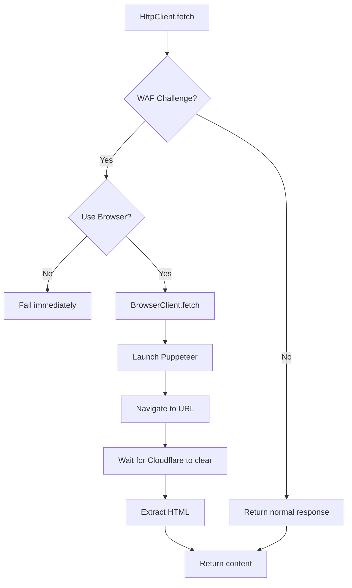

# Plan: Bypass Cloudflare WAF for bdnews24 Scraper

## Problem
The bdnews24 scraper fails with `waf_challenge` error because `bangla.bdnews24.com` uses Cloudflare WAF protection that blocks automated requests.

## Solution
Implement browser automation using Puppeteer to render JavaScript and bypass Cloudflare challenges.

## Implementation Steps

### Step 1: Add Puppeteer dependency
**File:** `package.json`
- Add `puppeteer` to dependencies
- Run `npm install` to install

### Step 2: Create BrowserClient utility
**New File:** `src/scraper/utils/BrowserClient.js`

A new class that wraps Puppeteer with:
- Headless Chrome browser instance management
- Automatic Cloudflare challenge detection and waiting
- HTML content extraction after page load
- Resource optimization (disable images, scripts for faster loading)
- Proper cleanup on exit

### Step 3: Modify HttpClient for browser fallback
**File:** `src/scraper/utils/HttpClient.js`

- Import BrowserClient
- Check if target URL requires browser automation (via config)
- On WAF challenge detection, fallback to BrowserClient
- Add method `_shouldUseBrowser(url)` to check if browser is needed

### Step 4: Update source configuration
**File:** `src/scraper/config.js`

- Add `useBrowser: true` flag to bdnews24 source configuration
- This enables browser automation for that specific source

### Step 5: Test the implementation
- Run `npm run all:start`
- Verify scraper can fetch bdnews24 homepage without WAF error

## Architecture

## Notes
- Browser automation is resource-intensive; only use for WAF-protected sites
- Puppeteer will download Chromium (~150MB) on first run
- Consider using `puppeteer-core` if Chrome is already installed
