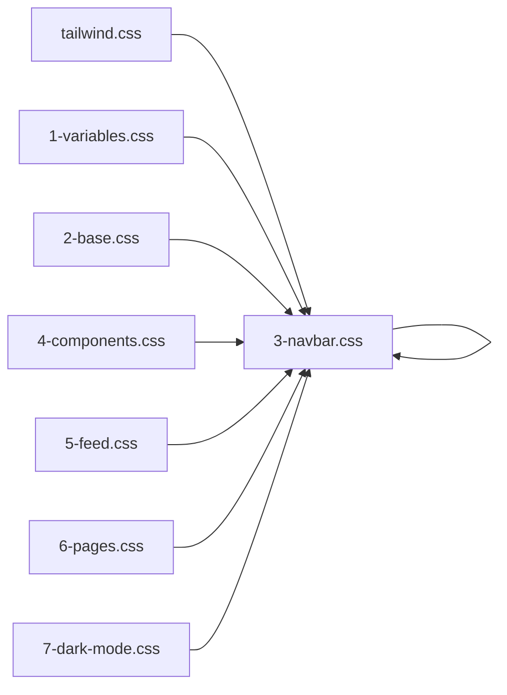

# Page Load Optimization Plan

## Executive Summary
Based on network analysis, the Deploy Tools page takes approximately **9+ seconds** to fully load. This plan outlines comprehensive optimizations to reduce load time to under 2 seconds.

## Current Issues Identified

### Network Log Analysis (14:25:44 - 14:25:53)
```
Total Load Time: ~9 seconds
- CSS Files: 6 separate requests (tailwind, variables, base, dark-mode, admin, ai-style)
- JS Files: 8+ separate requests  
- External CDN: Bootstrap, SweetAlert2, Fonts (4+ seconds)
- 404 Error: favicon.ico (1083ms wasted)
- Firebase: Multiple initialization requests
```

### Critical Issues

| Issue | Impact | Priority |
|-------|--------|----------|
| Multiple CSS files (6+) | High | Critical |
| Multiple JS files (8+) | High | Critical |
| External CDN dependencies | Medium | High |
| No minification/bundling | High | Critical |
| Missing favicon (404) | Low | Medium |
| Large inline JSON-LD | Medium | Medium |
| No lazy loading | Medium | High |

## Optimization Strategy

### 1. Fix 404 Favicon Error ⚡
**Impact:** Saves ~1 second per page load
- Current path requested: `/uploads/logo/favicon-1772727914-1317.ico`
- Fix: Create proper favicon at `/assets/favicon.ico` or update config

### 2. CSS Bundling & Minification 📦
**Current:** 6+ separate CSS files loaded
**Target:** Single minified CSS file



**Files to combine:**
- `/assets/css/tailwind.css`
- `/assets/css/1-variables.css`
- `/assets/css/2-base.css`
- `/assets/css/3-navbar.css`
- `/assets/css/4-components.css`
- `/assets/css/5-feed.css`
- `/assets/css/6-pages.css`
- `/assets/css/7-dark-mode.css`

### 3. JavaScript Bundling & Minification 📦
**Current:** 8+ separate JS files
**Target:** Single minified JS bundle

**Files to combine (public):**
- `bootstrap-lite.js`
- `sweetalert2-handler.js`
- `datepicker.js`
- `theme-manager.js`
- `script.js`

**Files to combine (admin):**
- `app-config.js`
- `bootstrap-lite.js`
- `sweetalert2-handler.js`
- `datepicker.js`
- `theme-manager.js`
- `admin.js`
- `activity.js`

### 4. External CDN Optimization 🌐

| Resource | Current | Optimized |
|----------|---------|-----------|
| Bootstrap CSS | External CDN | Local + Cache headers |
| Bootstrap Icons | External CDN | Local + Cache headers |
| SweetAlert2 | External CDN | Local + Cache headers |
| Google Fonts | External | Self-hosted or remove |

### 5. Firebase Optimization 🔥

**Current Issues:**
- Multiple Firebase initialization requests
- Loaded on every page even for guests
- Blocking page render

**Optimization:**
```javascript
// Load Firebase only when user logs in
if (userIsAuthenticated) {
    loadFirebase();
}
```

### 6. Inline JSON-LD Optimization 📋

**Current:** Large inline scripts in `<head>` (blocking)
**Target:** Remove non-essential schemas OR defer loading

### 7. Image Lazy Loading 🖼️

```html
<!-- Current -->


<!-- Optimized -->

```

### 8. Critical CSS Extraction 🎯

Extract only the CSS needed for above-the-fold content:
```html
<style>
/* Critical CSS only */
</style>
<link rel="preload" href="bundle.min.css" as="style" 
      onload="this.onload=null;this.rel='stylesheet'">
```

## Implementation Steps

### Phase 1: Quick Wins (Day 1)
- [ ] Fix favicon 404 error
- [ ] Add cache headers to .htaccess
- [ ] Add `loading="lazy"` to all images
- [ ] Defer non-critical JS

### Phase 2: Bundling (Day 2-3)
- [ ] Create CSS build pipeline
- [ ] Create JS build pipeline  
- [ ] Update layout files to use bundles
- [ ] Add cache busting (version params)

### Phase 3: CDN & Optimization (Day 4-5)
- [ ] Host Bootstrap locally
- [ ] Host SweetAlert2 locally
- [ ] Self-host fonts or use system fonts
- [ ] Implement HTTP/2 push

### Phase 4: Advanced (Day 6-7)
- [ ] Lazy load Firebase
- [ ] Remove/reduce JSON-LD
- [ ] Add service worker for caching
- [ ] Performance testing

## Expected Results

| Metric | Before | After |
|--------|--------|-------|
| Page Load Time | ~9s | <2s |
| Requests | 30+ | <10 |
| CSS Requests | 6+ | 1 |
| JS Requests | 8+ | 1 |
| 404 Errors | 1 | 0 |

## Technical Requirements

### Build Tool Setup
```bash
# Install build tools
npm install -D terser cssnano postcss autoprefixer

# Create build script
npm run build:css
npm run build:js
```

### .htaccess Caching
```apache
<IfModule mod_expires.c>
  ExpiresActive On
  ExpiresByType text/css "access plus 1 year"
  ExpiresByType application/javascript "access plus 1 year"
  ExpiresByType image/png "access plus 1 year"
</IfModule>
```

## Testing Checklist

- [ ] Lighthouse Performance Score >90
- [ ] First Contentful Paint <1s
- [ ] Largest Contentful Paint <2.5s
- [ ] Time to Interactive <3.5s
- [ ] Cumulative Layout Shift <0.1
- [ ] No console errors
- [ ] All pages load correctly
