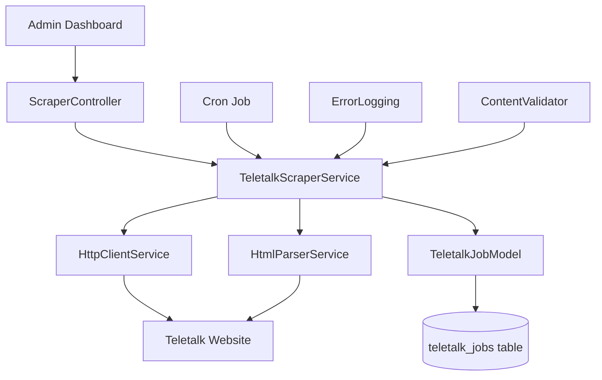
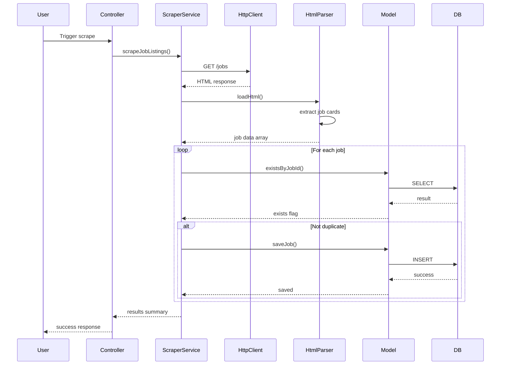

# Teletalk Scraper Refactoring Plan

## Overview
Refactor the standalone Teletalk government jobs scraper to integrate with the existing broxlab scraper infrastructure, following project coding standards and best practices.

## Current State Analysis

### Existing Teletalk Scraper Issues
- **Regex-based parsing**: Fragile and hard to maintain
- **No error handling**: Basic try-catch missing
- **No database integration**: Only outputs to JSON
- **No pagination**: Only scrapes single page
- **No duplicate detection**: May scrape same jobs repeatedly
- **No logging**: Difficult to debug issues
- **Standalone script**: Not integrated with existing infrastructure

### Existing Broxlab Scraper Infrastructure
- [`ScraperService.php`](../app/Modules/Scraper/ScraperService.php) - Basic metadata scraping
- [`ArticleScraper.php`](../app/Modules/Scraper/ArticleScraper.php) - Article content extraction
- [`HtmlParserService.php`](../app/Modules/Scraper/HtmlParserService.php) - DOM-based parsing with Symfony
- [`HttpClientService.php`](../app/Modules/Scraper/HttpClientService.php) - HTTP request handling
- [`SourceConfigManager.php`](../app/Modules/Scraper/SourceConfigManager.php) - Source-specific configurations
- [`DuplicateCheckerService.php`](../app/Modules/Scraper/DuplicateCheckerService.php) - Duplicate detection
- [`PaginationHandler.php`](../app/Modules/Scraper/PaginationHandler.php) - Pagination support

## Refactoring Plan

### Phase 1: Core Service Creation

#### 1.1 Create TeletalkScraperService
**File**: `app/Modules/Scraper/TeletalkScraperService.php`

**Responsibilities**:
- Scrape job listings from Teletalk website
- Extract job metadata (title, organization, openings, URL, image)
- Handle pagination across multiple pages
- Integrate with existing HttpClientService and HtmlParserService

**Key Methods**:
```php
public function scrapeJobListings(int $page = 1, int $limit = 20): array
public function scrapeJobDetail(string $jobUrl): array
public function scrapeAllPages(int $maxPages = 10): array
```

**Dependencies**:
- `HttpClientService` - For HTTP requests
- `HtmlParserService` - For DOM-based parsing
- `ContentValidator` - For data validation

#### 1.2 Create TeletalkJobModel
**File**: `app/Models/TeletalkJobModel.php`

**Responsibilities**:
- Database operations for Teletalk jobs
- CRUD operations with prepared statements
- Duplicate checking
- Pagination queries

**Database Schema**:
```sql
CREATE TABLE teletalk_jobs (
    id INT AUTO_INCREMENT PRIMARY KEY,
    job_id VARCHAR(50) UNIQUE NOT NULL,
    title VARCHAR(255) NOT NULL,
    organization VARCHAR(255) NOT NULL,
    openings INT DEFAULT 0,
    url VARCHAR(500) NOT NULL,
    image_url VARCHAR(500),
    scraped_at TIMESTAMP DEFAULT CURRENT_TIMESTAMP,
    updated_at TIMESTAMP DEFAULT CURRENT_TIMESTAMP ON UPDATE CURRENT_TIMESTAMP,
    INDEX idx_job_id (job_id),
    INDEX idx_organization (organization),
    INDEX idx_scraped_at (scraped_at)
);
```

**Key Methods**:
```php
public function saveJob(array $jobData): bool
public function getJobByJobId(string $jobId): ?array
public function existsByJobId(string $jobId): bool
public function getRecentJobs(int $limit = 20, int $offset = 0): array
public function searchJobs(string $query, int $limit = 20, int $offset = 0): array
```

### Phase 2: Configuration Management

#### 2.1 Create Teletalk Source Config
**File**: `app/Modules/Scraper/config/teletalk.php`

**Configuration**:
```php
return [
    'base_url' => 'https://alljobs.teletalk.com.bd',
    'selectors' => [
        'job_card' => '.job-wrapper',
        'job_link' => '.job-card',
        'job_title' => '.job-title h3',
        'job_image' => '.job-card-img-wrapper img',
        'job_openings' => '.total-openings',
    ],
    'pagination' => [
        'enabled' => true,
        'max_pages' => 10,
        'page_param' => 'page',
    ],
    'rate_limit' => [
        'delay_ms' => 1000,
        'max_retries' => 3,
    ],
];
```

### Phase 3: Integration Points

#### 3.1 Create Scraper Controller
**File**: `app/Controllers/ScraperController.php`

**Endpoints**:
- `GET /admin/scraper/teletalk` - Dashboard view
- `POST /admin/scraper/teletalk/scrape` - Trigger scraping
- `GET /admin/scraper/teletalk/jobs` - List scraped jobs
- `GET /admin/scraper/teletalk/jobs/{id}` - View job details

#### 3.2 Create Admin View
**File**: `app/Views/admin/scraper/teletalk.twig`

**Features**:
- Manual scrape trigger button
- Last scrape status display
- Job listing table with pagination
- Search and filter options
- Export to CSV/JSON

### Phase 4: Automation

#### 4.1 Create Cron Job Script
**File**: `scripts/cron/teletalk-scraper.php`

**Features**:
- Scheduled scraping (daily/hourly)
- Email notifications on new jobs
- Error logging
- Status reporting

#### 4.2 Add to Cron Configuration
**File**: `docs/CPANEL_CRONJOBS.md`

**Add entry**:
```
# Teletalk Jobs Scraper - Daily at 6 AM
0 6 * * * /usr/bin/php /path/to/broxlab/scripts/cron/teletalk-scraper.php
```

### Phase 5: Error Handling & Logging

#### 5.1 Error Handling Strategy
- Use `ErrorLogging` helper for consistent error logging
- Implement retry logic with exponential backoff
- Graceful degradation on partial failures
- Detailed error messages for debugging

#### 5.2 Logging Points
- HTTP request failures
- Parsing errors
- Database operation failures
- Duplicate job detection
- Rate limit violations

### Phase 6: Testing

#### 6.1 Unit Tests
**File**: `tests/Modules/Scraper/TeletalkScraperServiceTest.php`

**Test Cases**:
- Parse job card HTML correctly
- Extract all required fields
- Handle missing data gracefully
- Pagination works correctly
- Duplicate detection works

#### 6.2 Integration Tests
- End-to-end scraping workflow
- Database integration
- API endpoint responses

## Architecture Diagram



## Data Flow



## Implementation Priority

1. **High Priority** (Core functionality):
   - Create TeletalkScraperService
   - Create TeletalkJobModel with database schema
   - Implement basic scraping with DOM parsing
   - Add duplicate detection

2. **Medium Priority** (Enhanced features):
   - Add pagination support
   - Create admin controller and views
   - Add error handling and logging
   - Create cron job script

3. **Low Priority** (Nice to have):
   - Unit tests
   - Export functionality
   - Email notifications
   - Advanced search and filtering

## Coding Standards Compliance

- **Security**: Use prepared statements for all DB operations
- **Input Validation**: Validate all scraped data before storage
- **Error Handling**: Use ErrorLogging helper consistently
- **Naming**: Follow camelCase for PHP, snake_case for DB columns
- **Architecture**: Separate concerns (Service, Model, Controller, View)
- **Documentation**: Add PHPDoc comments to all public methods

## Migration Strategy

1. Create new database table
2. Implement new service alongside existing script
3. Test with sample data
4. Gradually migrate to new system
5. Deprecate old regex-based script
6. Remove old files after validation period

## Success Criteria

- [ ] Successfully scrape job listings without regex
- [ ] Store jobs in database with proper schema
- [ ] Detect and skip duplicate jobs
- [ ] Handle pagination across multiple pages
- [ ] Provide admin interface for viewing jobs
- [ ] Include automated cron job for daily scraping
- [ ] Follow all project coding standards
- [ ] Include proper error handling and logging
